# Task-1 Ascending the Gradient Descent

First the dataset was generated by the provided code.

Q1. True gradient of the function was calculated using torch.autograd

Q2. Stochastic gradient descent was calculated for all points in the dataset and expected stochastic gradient was calculated by averaging.

Q3. note: $\alpha$=0.01, $\theta_0$=1.0 and $\theta_1$=1.0 in all the cases in order to make comparisions between the results.

minima is obtained by using normal equation.

Full-batch gradient descent: convergence at epoch: 584
, iteration: 584

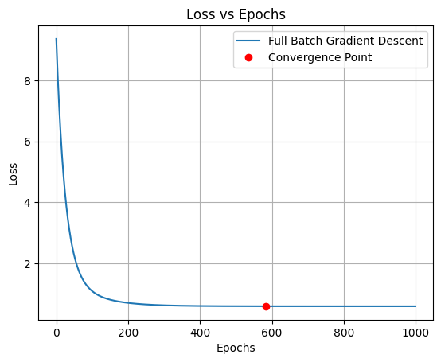
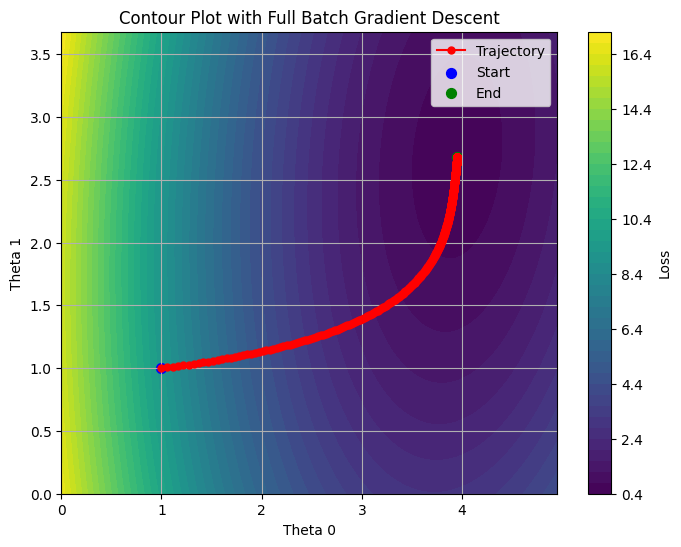
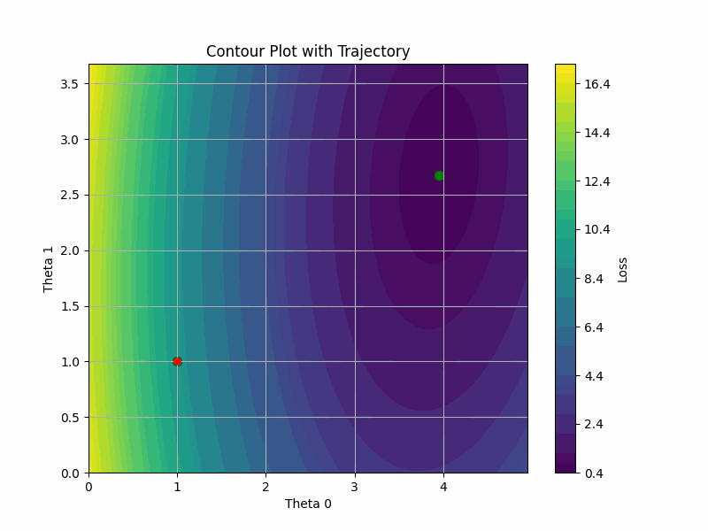

Mini-batch gradient descent: convergence at epoch: 117
, iteration: 936

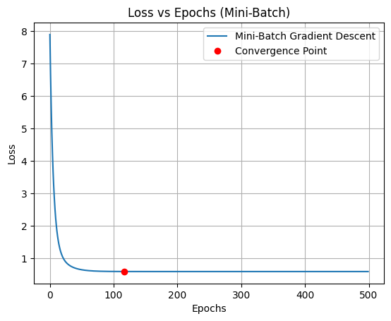
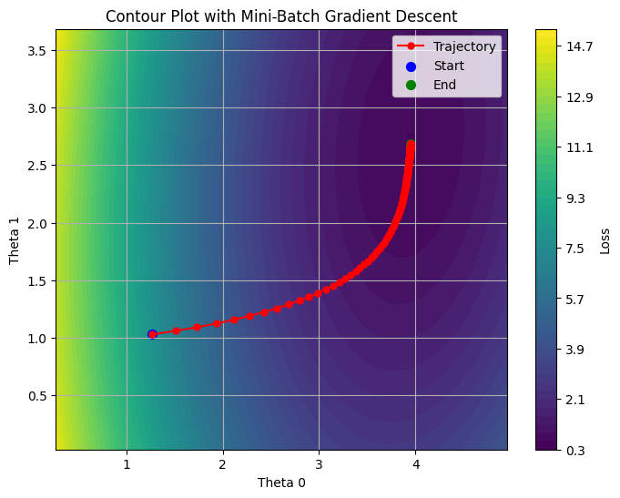
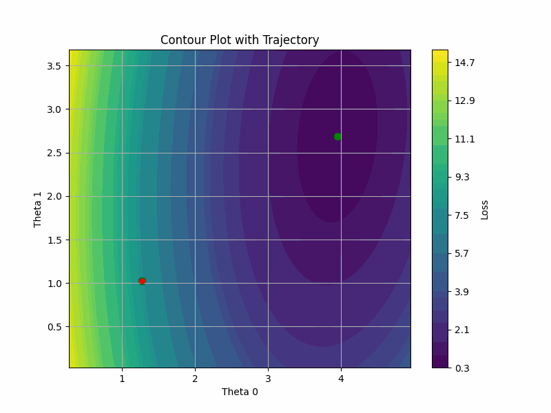

Sochastic gradient descent: convergence at epoch: 117
, iteration: 936

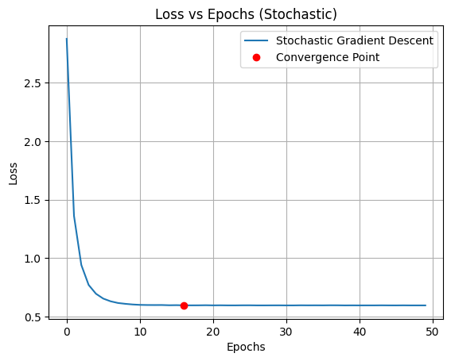
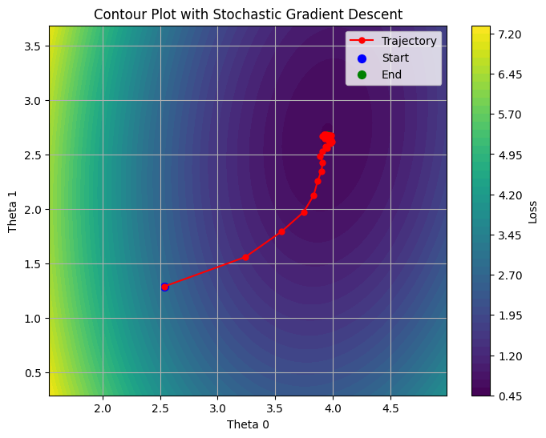
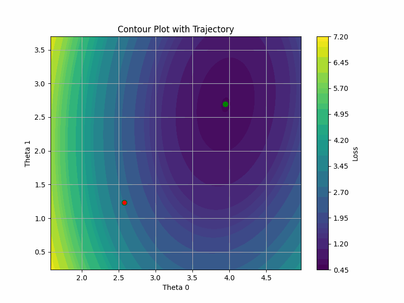

From above observations, it can be concluded that stochastic gradient descent is the fastest followed by mini-batch gradient descent and full-batch gradient descent. This is because the number of iterations in 1 epoch of stochastic gradient descent is sample_size while it is sample_size/batch_size in mini-batch gradient descent and 1 in full-batch gradient descent.

Q4.

Full-batch gradient descent with momentum($\alpha$=0.01,momentum factor=0.6):
convergence at epoch: 38

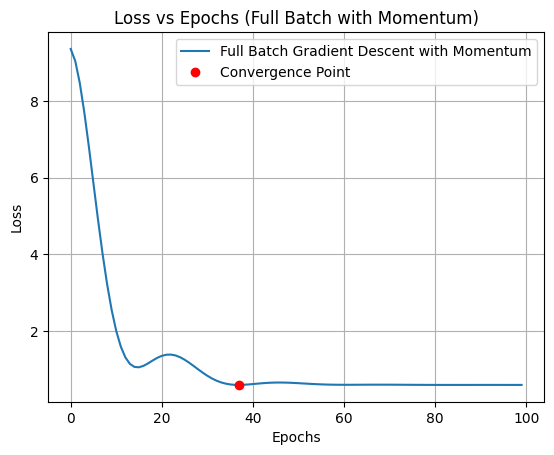
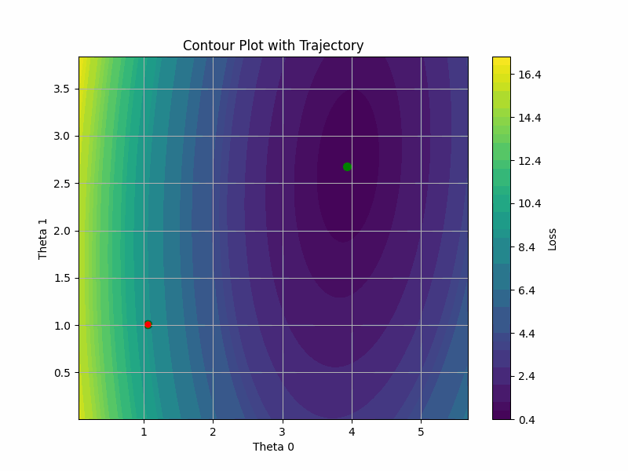

Stochastic gradient descent with momentum($\alpha$=0.005,momentum factor=0.6):
convergence at epoch: 10

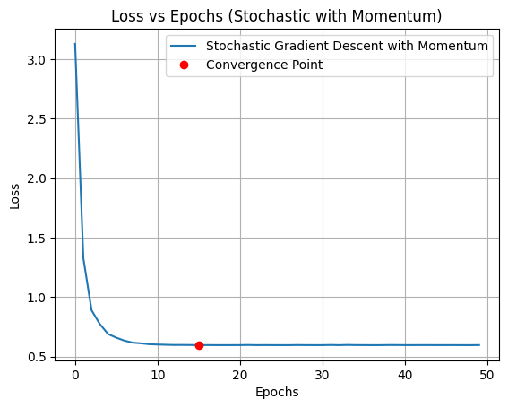
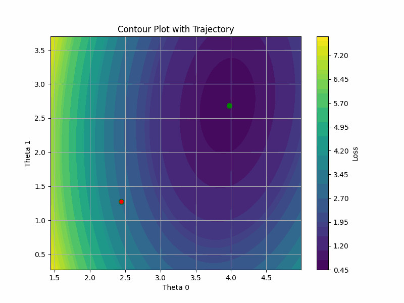

This because momentum term averages out the step size by making step size larger in regions where gradient is shallow and make step size smaller where gradient is steep. This overall increases the convergance speed. Hence, the full-batch gradient descent with momentum implementation faster than vanilla gradient descent. Momentum implementation also prevents gradient descent stucking in local minima.
