# Task-5 Image Compression using Matrix Factorisation

You have an image patch of size (50x50) that you want to compress using matrix factorization. To do this, you'll split the patch [N×N] into two smaller matrices of size [N×r] and [r×N] using matrix factorization. Compute the compressed patch by multiplying these two matrices and compare the reconstructed image patch with the original patch. Compute the Root Mean Squared Error (RMSE) and Peak Signal-to-Noise Ratio (PSNR) between the original and reconstructed image patches.

- Test different values for the low-rank r=[5,10,25,50].
- Use Gradient Descent to learn the compressed matrices.
- Display the reconstructed image patches, keeping the original pixel values outside the patch unchanged, and use your compressed matrix for the patch to show how well the reconstruction works.
- Compute the RMSE and PSNR for each value of r.


## Solution:

Matrix factorization is a technique used to compress image data by approximating the image matrix with lower-dimensional components, while retaining the overall structure of the image. Instead of reducing resolution, it compresses the necessary information to represent the image effectively.

## How Image Compression Works?

1. **Image Matrix Representation**: An image is represented as a matrix `A` of size $(M \times N)$, where $M$ is the number of rows (height) and $N$ is the number of columns (width).

2. **Factorization**: The original matrix `A` is factorized into two smaller matrices:
   - `W` of size $(M \times r)$
   - `H` of size $(r \times N)$
   
   Here, $r$ is a rank that is significantly smaller than $M$ or $N$. This allows for effective compression while maintaining an approximation of the original image.


Without compression, the original image matrix requires storing **M \* N** values, representing every pixel. However, by applying matrix factorization, the storage requirement drops to **(M \* r) + (r \* N)** values, significantly reducing the space needed. As the rank **r** decreases, the compression ratio increases, allowing for more efficient storage. However, this comes at the cost of image quality, as lower ranks lead to a loss of fine details, which can be noticed as blurring.

## Image Compression
First, we extracted three 50x50 patches from the image and then performed image compression and matrix factorization on each one of them with the varying rank = [5,10,25,50].

## Patch-1

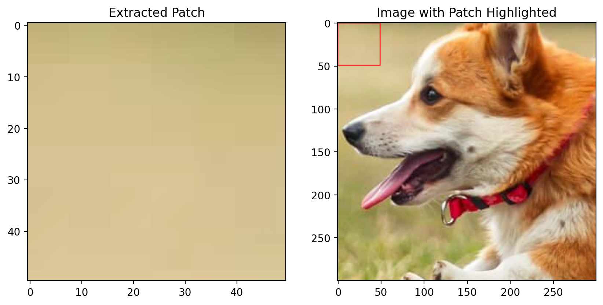
- **Rank = 5**

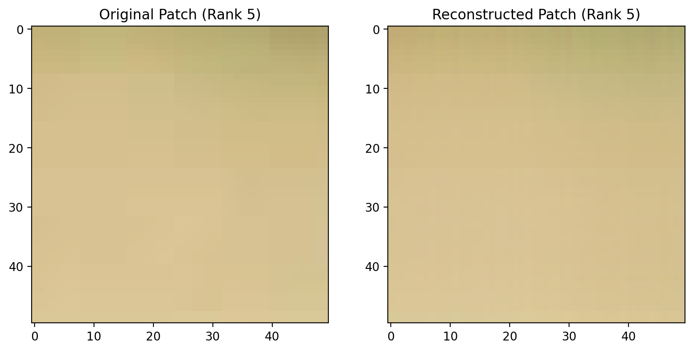 

    ```
    RMSE: 0.006451
    PSNR: 43.807847
    ```

- **Rank = 10**

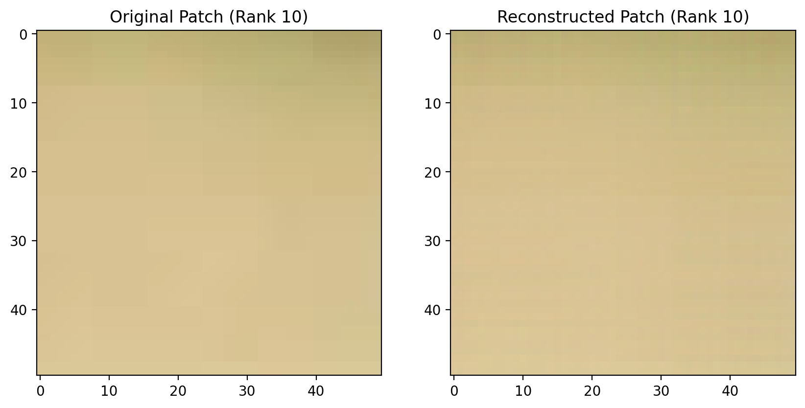   

    ```
    RMSE: 0.006834
    PSNR: 43.307004
    ```

- **Rank = 20**

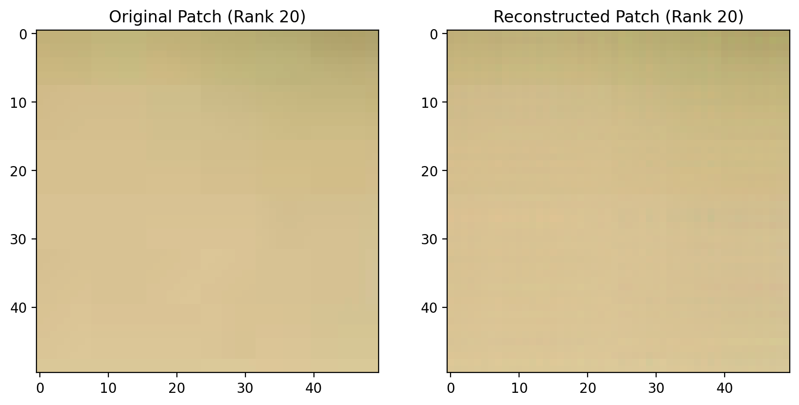    

    ```
    RMSE: 0.003929
    PSNR: 48.114580
    ```

- **Rank = 50**

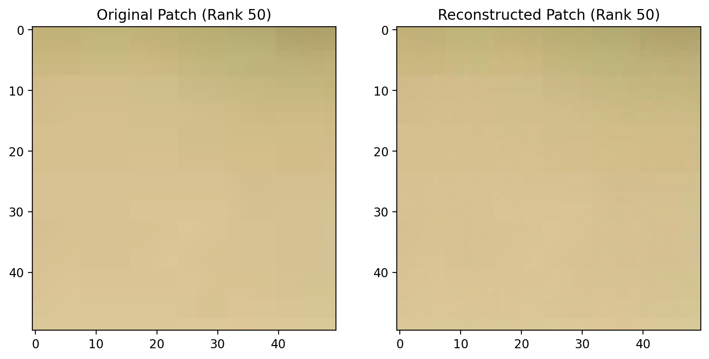 

    ```
    RMSE: 0.003483
    PSNR: 49.161294
    ```

Graphs illustrating RMSE vs Rank and PSNR vs Rank for Patch-1 are displayed below:

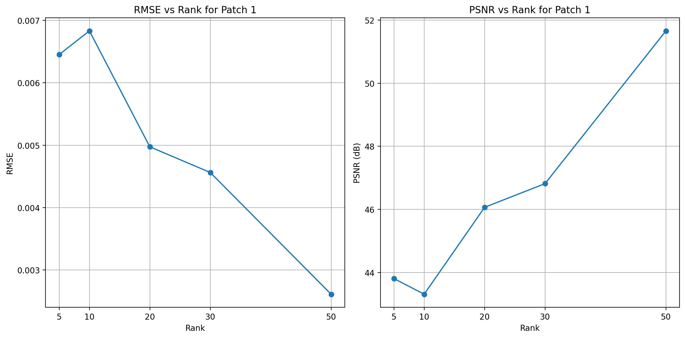

## Patch-2

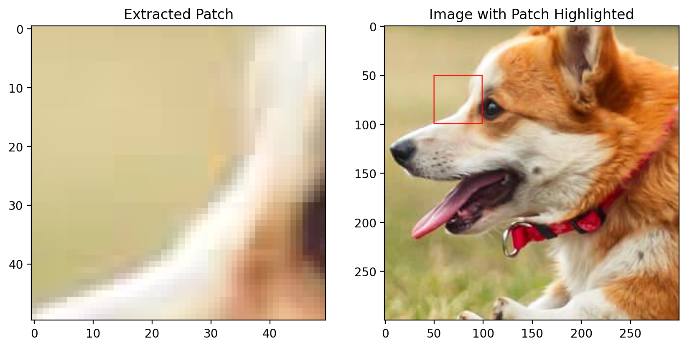

- **Rank = 5**
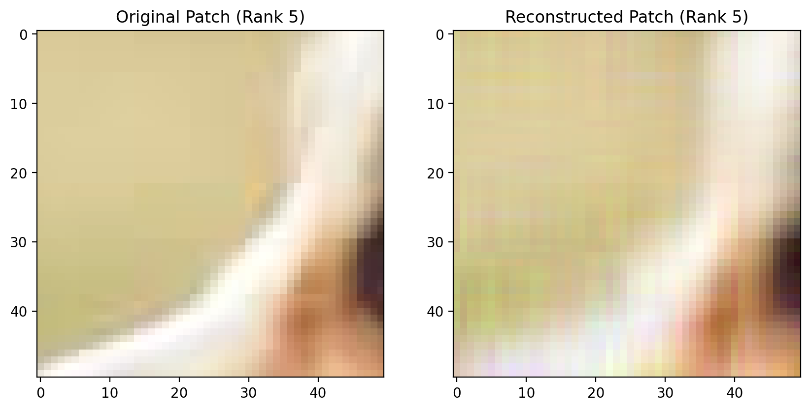

    ```
    RMSE: 0.030466
    PSNR: 30.323810
    ```

- **Rank = 10**
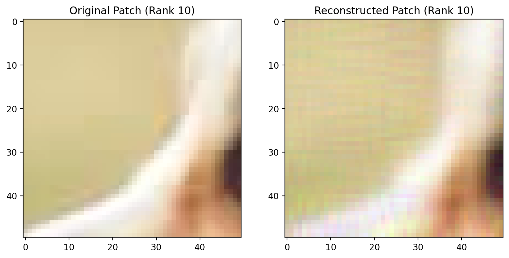

    ```
    RMSE: 0.025922
    PSNR: 31.726516
    ```

- **Rank = 20**

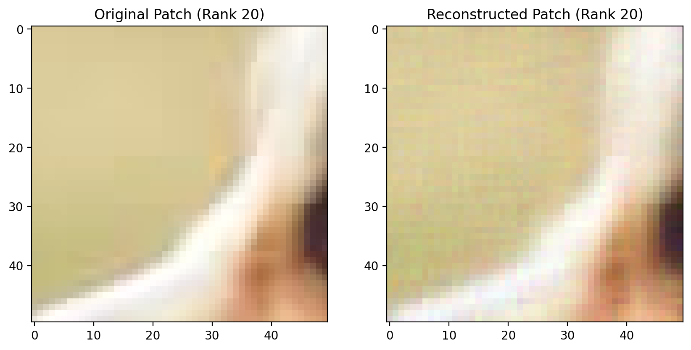   

    ```
    RMSE: 0.015575
    PSNR: 36.151359
    ```

- **Rank = 50**

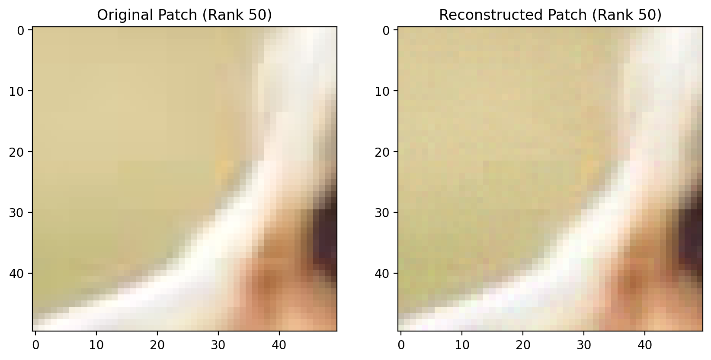 

    ```
    RMSE: 0.009523
    PSNR: 40.424417
    ```

Graphs illustrating RMSE vs Rank and PSNR vs Rank for Patch-2 are displayed below:

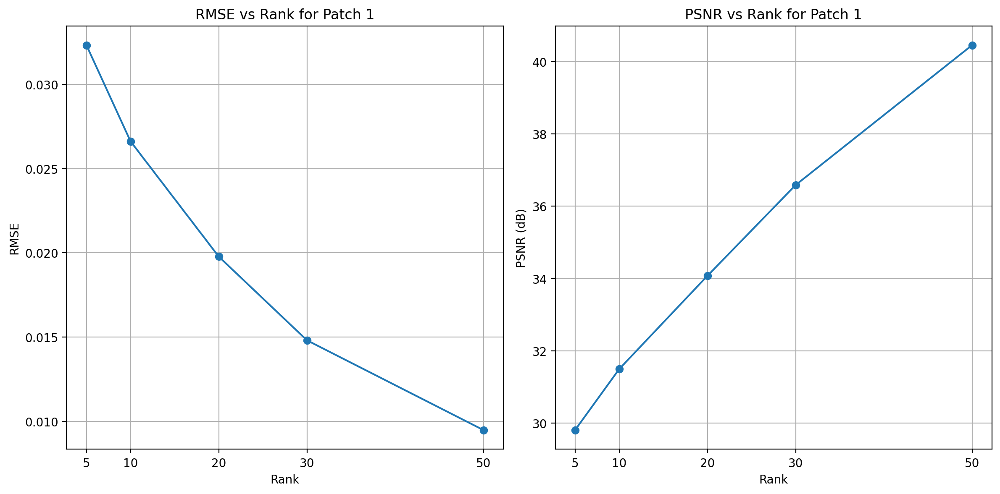

## Patch-3

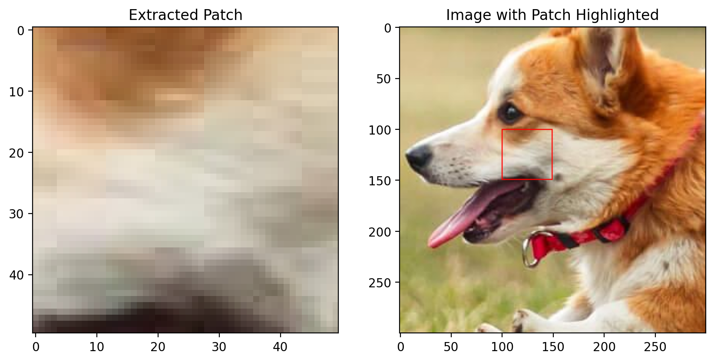

- **Rank = 5**

  

    ```
    RMSE: 0.031112
    PSNR: 30.141574
    ```

- **Rank = 10**

 

    ```
    RMSE: 0.023612
    PSNR: 32.537242
    ```

- **Rank = 20**


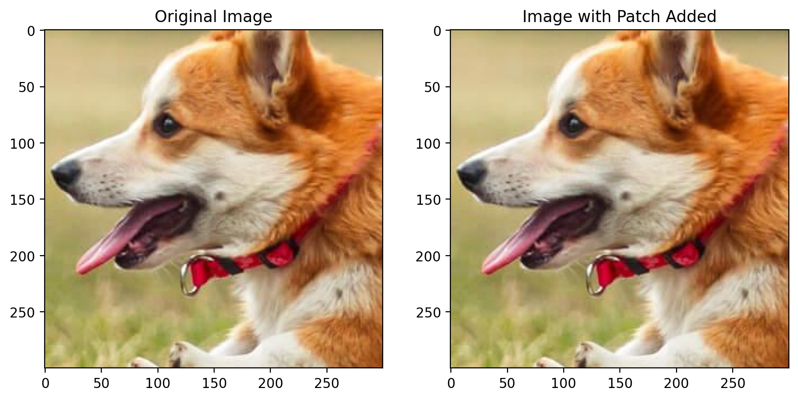
    ```
    RMSE: 0.017403
    PSNR: 35.187531
    ```

- **Rank = 30**

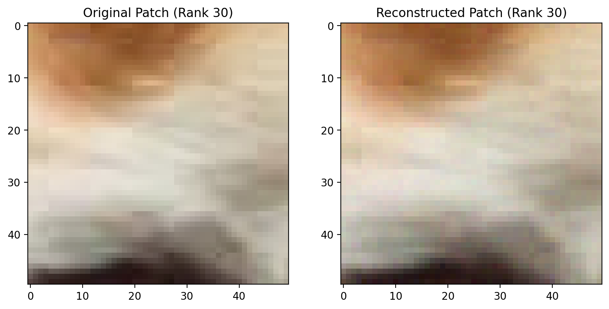

    ```
    RMSE: 0.008954
    PSNR: 40.960107
    ```
- **Rank = 50**


Graphs illustrating RMSE vs Rank and PSNR vs Rank for Patch-3 are displayed below:

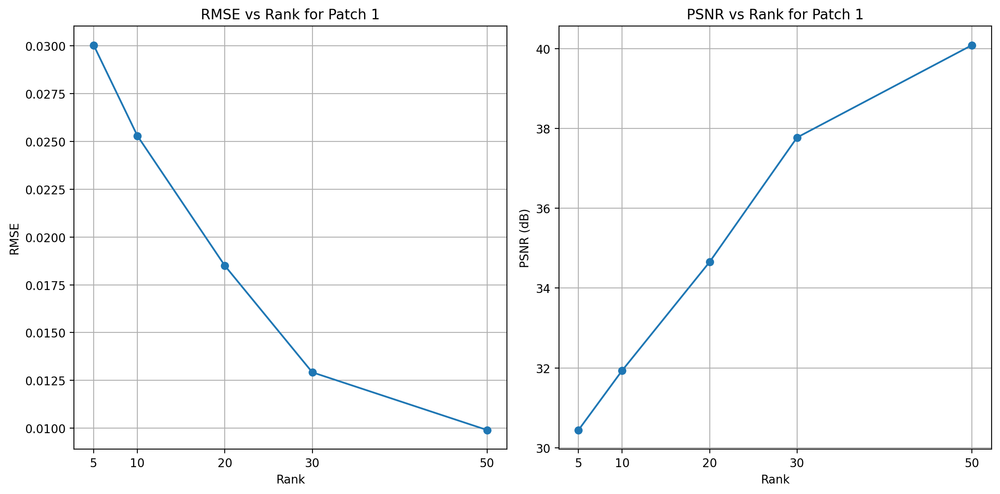
